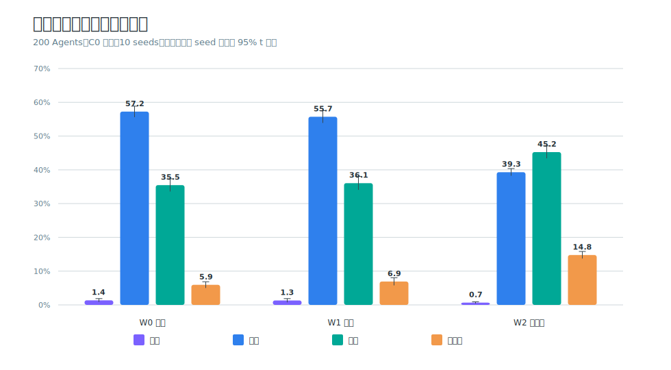
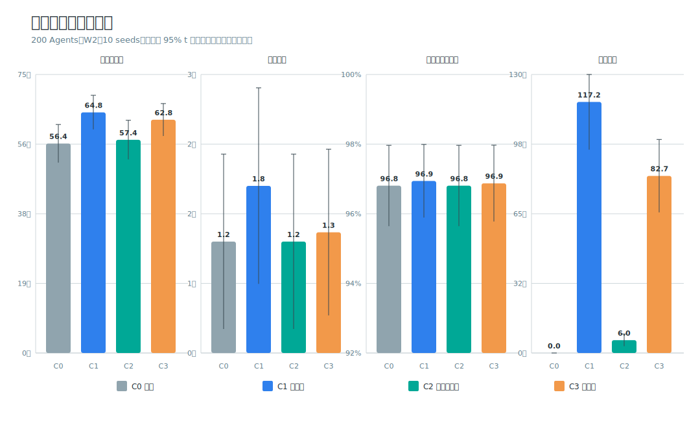
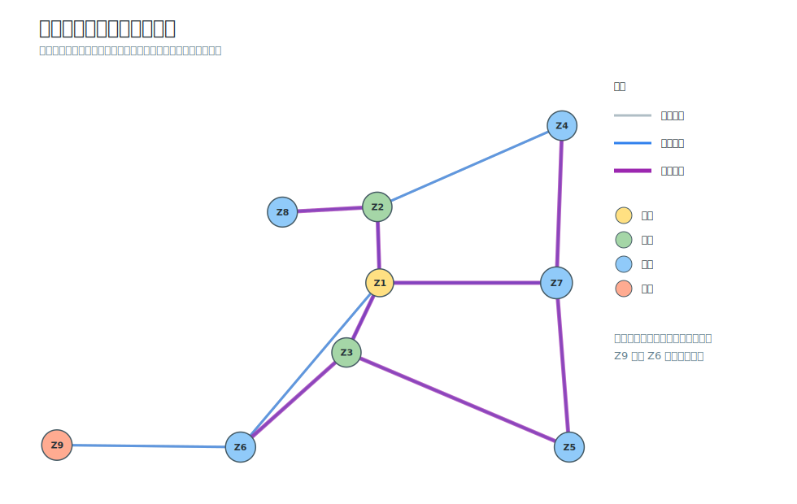
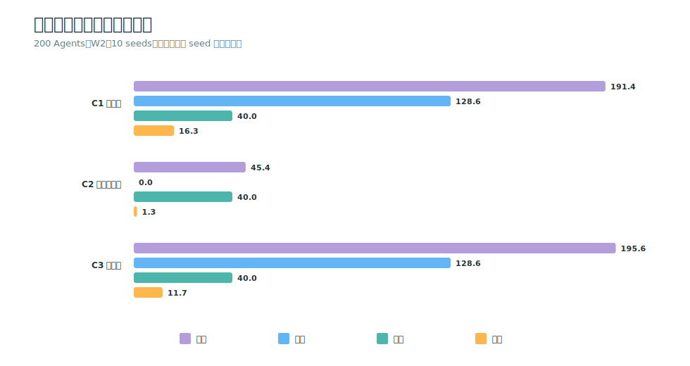

# UrbanCup 2026：极端天气下的网约车出行公平模拟

[](https://github.com/JennyXi/UrbanCup_2026_Jenny-Yoyo/actions/workflows/tests.yml)


本项目构建一个以上海人口结构和空间趋势为参考的九区合成城市，研究极端高温、强降雨、数字接入和网约车补贴如何共同影响不同年龄与数字能力人群的出行机会。

项目已经从人口与活动计划扩展为可运行的综合交通机制实验：Agent 会在步行、公交、地铁、公交—地铁接驳和网约车之间选择；网约车实行车辆级空间—时间守恒、派单等待与一次 fallback；C0–C4 优惠券（含官网 PublicGoodsAgent 适配）、老年数字接入和派单优先政策均有配对实验与审计输出。

> 本项目是机制模拟，不是上海交通预测。九区边界、交通供给和行为系数均为透明、可审计的合成参数。

## 30 秒看懂结果



在 200 Agents、10 seeds 的 C0 无券基线中，强降雨使公交份额下降，地铁与网约车承担更多出行。政策实验使用相同 Agents、活动、OD、天气和基础随机数做 seed 内配对比较。

| W2 强降雨政策 | 网约车请求 | 成功 | 失败 | 券核销 | 补贴支出 | 必要活动完成率 |
|---|---:|---:|---:|---:|---:|---:|
| C0 无券 | 56.4 | 55.2 | 1.2 | 0.0 | 0.0 元 | 96.81% |
| C1 公共券 | 64.8 | 63.0 | 1.8 | 16.3 | 117.2 元 | 96.94% |
| C2 老年定向券 | 57.4 | 56.2 | 1.2 | 1.3 | 6.0 元 | 96.81% |
| C3 混合券 | 62.8 | 61.5 | 1.3 | 11.7 | 82.7 元 | 96.87% |



当前结果支持四条机制结论：

1. 强降雨降低道路公交吸引力，地铁稳定性和网约车门到门服务变得更重要。
2. C1 与 C3 在 10/10 seeds 中增加网约车需求；有限车辆池使部分增量转化为局部派单失败。
3. 一次 fallback 吸收了大部分局部失败，因此必要活动完成率没有出现稳定的大幅变化。
4. 老年定向券名义覆盖高但核销低，说明“触达 → 获券 → 请求 → 成功服务”不能合并为一个指标。

完整的配对 95% 区间、交叉公平性差距和描述性预算效率见[竞赛结果卡](docs/results/COMPETITION_RESULTS.md)。

## 九区合成城市



- Z1 为传统就业中心，Z7 为综合副中心，Z6 为产业新城。
- Z2/Z3 为内城混合与老城区；Z4/Z5/Z8 为外围居住区。
- Z9 是远郊交通薄弱区，只通过 Z6 接入主体网络。
- 公交覆盖九区；地铁按线路和 Agent 两端可达性判断，不把“区内有站”解释为任意 OD 均可乘坐。
- 交通方案同时保留线路换乘、方式换乘和兼容字段 `transfers = line_transfer_count + mode_transfer_count`。

## 端到端机制


核心实现包括：

- T1：人口、就业状态、数字接入和七日 baseline activities；
- T2：W0/W1/W2 天气下的活动继续与取消；
- T3：补贴触达、资格、领取渠道与派单优先规则；
- T4/T6：九区空间配置、home zone 和 activity destination；
- T7–T10：多方式网络、分时供给、天气供给和动态道路拥堵；
- 综合实验：方式选择、车辆级派单、等待、fallback、优惠券核销和政策配对比较。

详细设计见[九区综合交通系统说明](whole_traffic_system/README.md)。

## 快速复现

核心模型与报告生成只依赖 Python 标准库，支持 Python 3.11–3.13。

### 1. 运行全部测试

```bash
python -B -X utf8 -m unittest discover -s tests
```

### 2. 运行九区 50-Agent 综合实验

```bash
python -B -X utf8 -m scripts.run_formal_nine_zone_50_experiment
```

输出默认写入 `outputs/`。该目录不会提交到 Git；已验收的归档结果位于 `whole_traffic_system/results/`。

### 3. 重建竞赛结果卡与图表

```bash
python -B -X utf8 -m scripts.build_competition_report
python -B -X utf8 -m scripts.build_competition_report --check
```

生成内容：

- `docs/results/competition_metrics.csv`：政策 × 天气的均值与 95% 区间；
- `docs/results/paired_policy_effects.csv`：相对 C0 的 seed 内配对变化；
- `docs/results/fairness_metrics.csv`：年龄—数字接入群体指标；
- `docs/results/equity_gaps.csv`：脆弱组相对年轻组的必要活动完成率差距；
- `docs/results/budget_efficiency.csv`：按实际核销与诱发请求计算的描述性支出指标；
- `docs/figures/*.svg`：从配置和归档 CSV 确定性生成的竞赛图表。

### 4. 重跑 200-Agent 优惠券实验

```bash
python -B -X utf8 -m scripts.run_formal_nine_zone_200_coupon_experiment \
  --seed-start 47 \
  --seed-count 10 \
  --workers 4 \
  --output-dir outputs/formal_nine_zone_200_coupon_10seeds
```

Windows PowerShell 可将续行符替换为反引号，或把命令写成一行。

更多环境、输入冻结与输出口径见[复现说明](docs/REPRODUCIBILITY.md)。

## 实验设计与可信度

- 固定 seed 可复现；Agent 输入顺序不改变个人规划。
- 同一 seed 的政策共享人口、活动、OD、天气和基础派单优先值。
- 网约车车辆逐车记录位置、占用状态、释放时间和目的地区域。
- 每个正式实验同时输出车辆守恒、方式计数、政策配对和非负值检查。
- 结果卡使用 Student t 区间，并明确区分均值、配对变化和区间是否跨越 0。
- 目前 10 seeds 是机制证据；正式现实外推前仍需更多 seeds、观测校准和外部验证。

## 优惠券公平性漏斗



C1–C3 都配置为每日 40 张券，但实际核销量和支出差异明显，因此当前政策不是严格等预算。仓库同时报告“元/核销”和“元/诱发请求”，但不把它们解释为现实福利或因果成本效益。

## 数据与参数证据

`data_collection/` 保存上海公开证据的来源登记、检索日志、数据字典、质量报告和参数映射。合成城市中未获得统一观测支持的速度、等待、换乘和行为参数均明确标记为 `model_assumption`，避免把情景设定误写为实测事实。

重建数据层：

```bash
cd data_collection
python scripts/build_all_databases.py
python -m pytest -q
```

数据层可能需要额外的 pandas、PyYAML、PyArrow 与 Git LFS；核心交通模型和竞赛结果卡不依赖这些包。

## 结果索引

- [Agent 决策关联与顺序共享状态系统](docs/interdependent_agent_decisions/README.md)
- [PublicGoodsAgent 公共品博弈分券机制](docs/public_goods_coupon_agent/README.md)
- [竞赛结果卡](docs/results/COMPETITION_RESULTS.md)
- [九区综合系统与主要发现](whole_traffic_system/README.md)
- [200-Agent机制与优惠券实验](whole_traffic_system/experiment_guides/formal_nine_zone_200_experiments.md)
- [两区简化涌现实验技术档案](docs/emergence_experiment/README.md)
- [数据质量报告](data_collection/docs/DATA_QUALITY_REPORT.md)
- [模型参数映射](data_collection/docs/MODEL_PARAMETER_MAPPING.md)
- [方法与边界声明](docs/METHOD_AND_LIMITATIONS.md)

## 当前边界

- 九区、OD、供给和行为系数是合成情景，不是上海行政区或实证通勤矩阵。
- 公交与地铁默认保证上车，尚未模拟拥挤拒载和容量约束。
- 道路反馈用于机制实验，不求解完整动态交通均衡。
- 当前政策比较不是严格等财政预算，也没有货币化福利函数。
- 200 Agents、10 seeds 不足以支持现实政策效应外推。
- AgentSociety 大规模端到端运行尚未作为本仓库的正式竞赛结果发布。

这些限制不是隐藏条件：所有正式结论必须同时引用结果卡的证据范围和不应支持的结论。

## 引用

仓库提供 `CITATION.cff`。若使用本项目，请同时说明使用的分支、提交 SHA、配置文件和 seed 范围。
